import { Callout } from 'nextra/components'

# Field descriptions for DeltaV

## The importance of describing your fields in a service

At registration of an agent service on the [Agentverse ↗️](https://agentverse.ai/), providing comprehensive information, especially in the description section, is paramount. A detailed service **description** not only elucidates the functionality of the service but also aids users in grasping its essence. This clarity fosters effective interactions, empowering users to navigate the system with confidence, knowing precisely what to anticipate.

Similarly, the **field description** of the service needs to be detailed enough so to provide a clear picture of each data `Model` the service requires for it to be executable. Hence, these descriptions serve as a guiding beacon for users, developers, and LLM alike. Each field explanation elucidates the purpose, usage, and expected inputs required by each Model class, streamlining interactions and facilitating execution. Enhanced understanding of field descriptions enables the LLM (i.e., the AI Engine) to interpret user requests accurately, thereby ensuring accurate service delivery.

For clarity, reinforcing key concepts could be done through repetition of keywords within the description. Such an approach minimizes ambiguity and mitigates the risk of misunderstandings. Whether for users or LLM, a clear and descriptive field description lay the foundation for smooth interactions and reliable service delivery.

Consider the following [service ↗️](/guides/agentverse/registering-agent-coin-toss#run-your-coin-toss-agent):

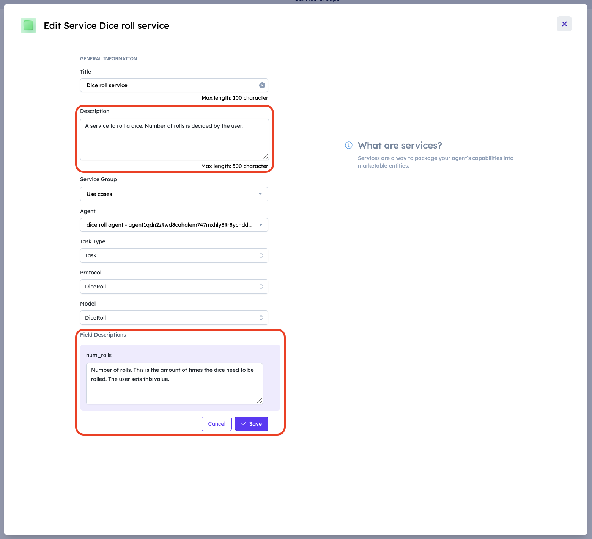

Providing a detailed field description for the `num_rolls` data `Model` is important to correctly execute the service. A well written field description enhances the LLM understanding of the type of **Task** or **Subtask** the service requires for execution. This would help in the accurate interpretation and execution of users' requests.

**It is possible to call subtasks from tasks or subtasks by specifying this within the field description itself**. For task and subtask network please refer to the below examples.

### Example 1: News Reading System

#### Task Field Description :

This service helps user to read news of a specific type. This service calls for a subtask to generate news. For a better understanding, you can find the overall guide for this example [here ↗️](/guides/agentverse/utilizing-api-to-build-network-of-task-and-subtask#news-reading-agent).

    <Callout type="info" emoji="ℹ️">
      Remember to always provide a comprehensive description for triggering the subtask in the field description so to ensure that the subtask is always initiated.
    </Callout>

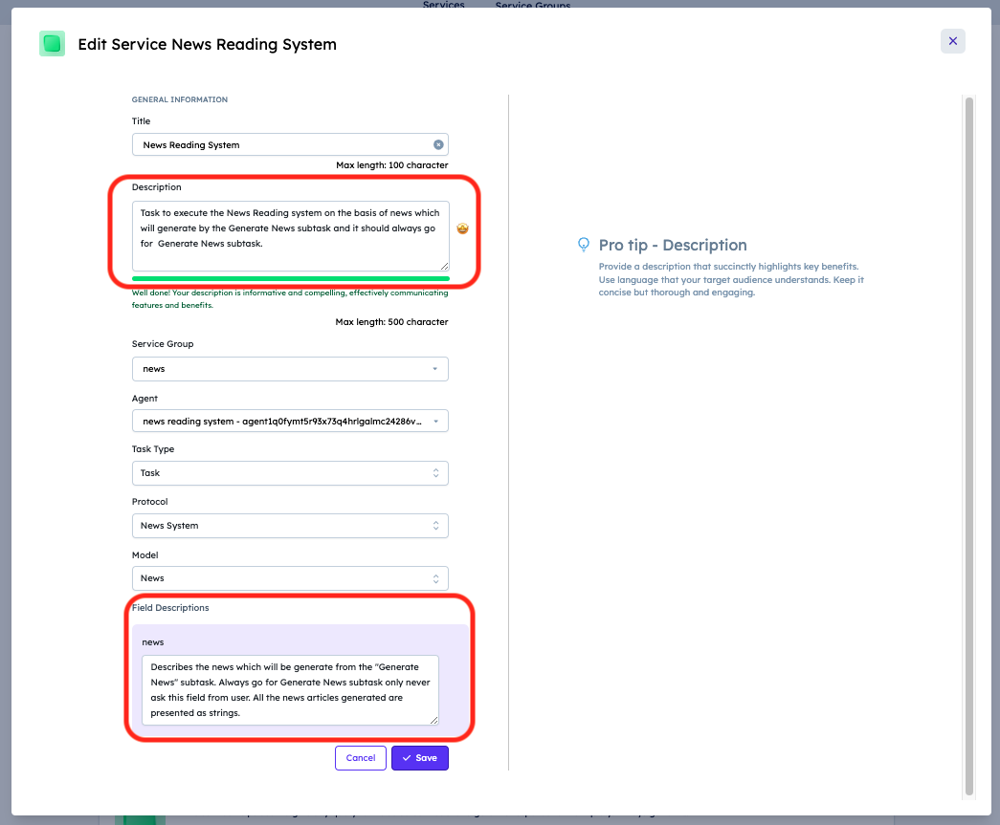

The field description for the `news` data model describes the news that will be presented to the user. It should be mentioned that it should be always provided by triggering of subtask. In our case, a good field description would be: **Describes the news which will be generate from the "Generate News" subtask. Always go for "Generate News" subtask only never ask this field from user. All the news articles generated are presented as strings**.

#### Subtask Field Description

This service helps task to generate news and send it to task or another subtask. Below, there is an example where the users ask for news category they want to read and provide news to task. For a better understanding, you can find the overall guide for this example [here ↗️](/guides/agentverse/utilizing-api-to-build-network-of-task-and-subtask#generate-categorical-news).

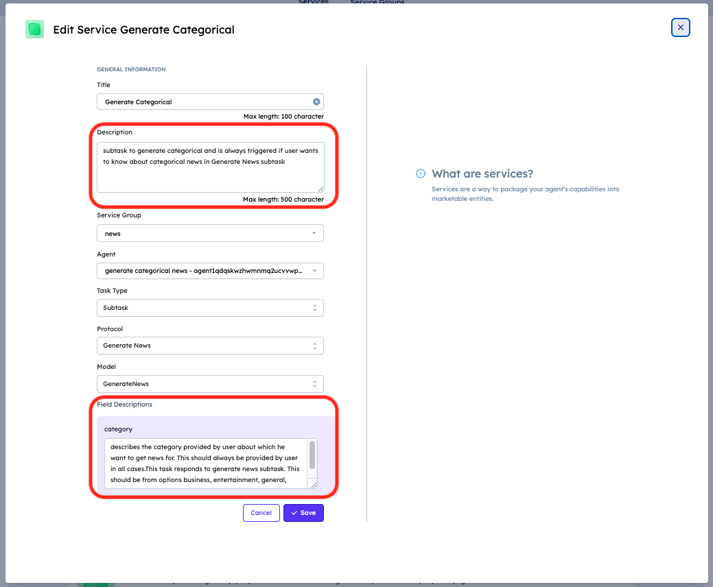

The field description for the `category` data model describes the category for which the user wants to read the news. It should be mentioned that it should be always provided by user. In our case, a good field description would be: **Describes the category provided by user about which he want to get news for. This should always be provided by user in all cases. This task responds to "Generate News" subtask. This should be from options business, entertainment, general, health, science, sports, technology**.

    <Callout type="info" emoji="ℹ️">
      _Remember to always include the subtask trigger in the field description_. This is very important to ensure that the subtask is being called. When selecting one of multiple subtasks, you need to use different names for each subtask. This way, we avoid confusion for the LLM.
    </Callout>

### Example 2: Hugging Face Text Classification Models:

This service helps user to choose a text classification model and make a query to that model. This task hugging face system goes for subtask to get make request to hugging face API which in turn trigger model list subtask to get list of model related to a search keyword. User can make query to their selected model

#### Task Field Description :

The field description for the `response` describes the response to be provided to the user. The task always triggers subtask **Hugging Face Request**. The ideal field description in this case will be like **Describes the response to the user query. Always go for Hugging face request subtask to get this field. Never ask this from user.**

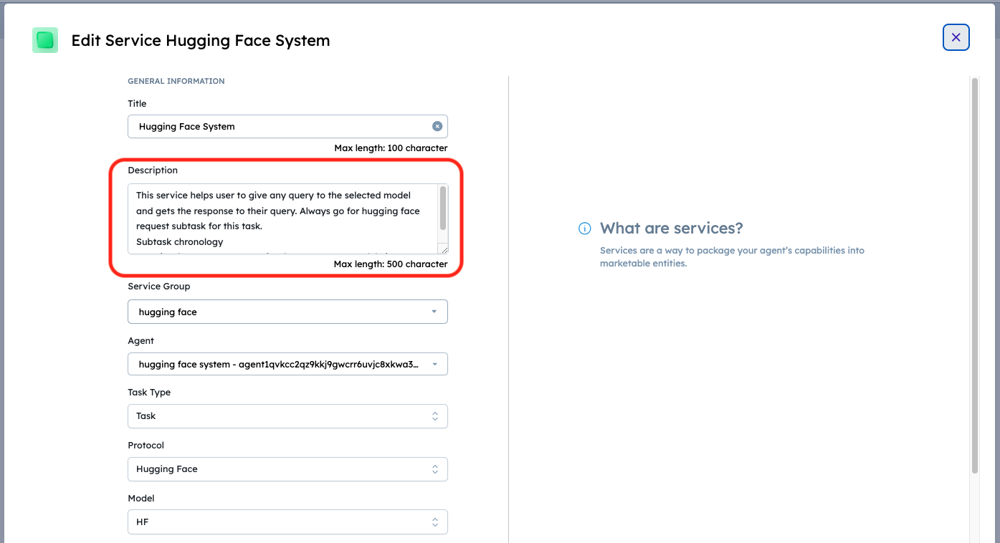

#### Subtask Field Description :

1. **Hugging face request :** This subtask has two fields `model_id`(to which query is to be made) and `query` (what request you want to make to the model). The `model_id` field again triggers **Model List** subtask which asks user for `search` keyword to get most downloaded models related to that keyword.

Ideal field description for this example will be like:

**model_id :** Always go for model list subtask. Never ask this field to user.  
**query :** Describes the query user wants to ask to the model. Always ask this to user after model_id is given by model list subtask.

    <Callout type="info" emoji="ℹ️">
      Remember to always provide a comprehensive description in `query` field that first we should fetch `model_id` using subtask before asking `query` to user.
    </Callout>

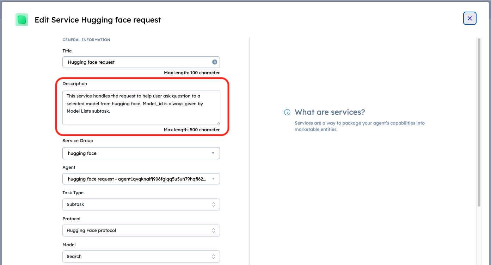
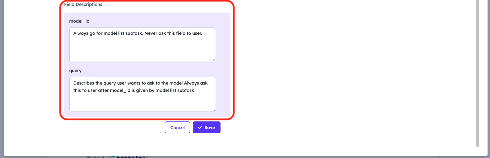

2. **Model List :** This subtask has field `Search` which searches for top 10 downloaded models related to that keyword from hugging face API and lets user selects from provided model id's.

Ideal field description for this example will be like:

**Search :** This is the type of model user wants to make query to. Always ask this to user. This always gives list of options to the user. Make user select one from these options. 

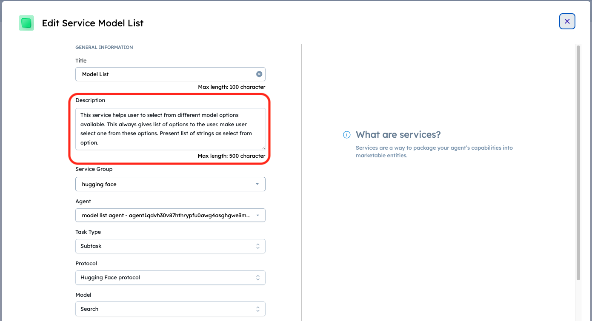
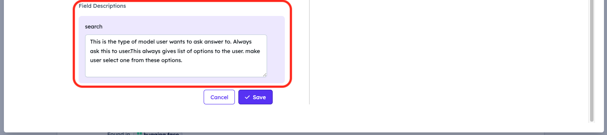

### Example 3: Local Business Finder :

This service helps user to find local businesses in any locality and specified category. This service returns list of 10 businesses to user and gives information about selected business by the user.

#### Task Field Description :

There are 3 fields in this task `category` (Type of business which user wants to search), `city` (City in which user wants to look around for business) and `name` (Name of the business which user wants to search.)
Ideal field descriptions for this example will be like:

**category :** This describes business category provided for which user wants to search business. Ask this from user.  
**city :** always go for city finder subtask to get user's city. Ask user if they want to use this city in yes/no question. ['yes':'use this city', 'no' : 'ask for city they want to search for'].  
**name :** Always Go for Subtask business finder service's response. Never ask this from user.

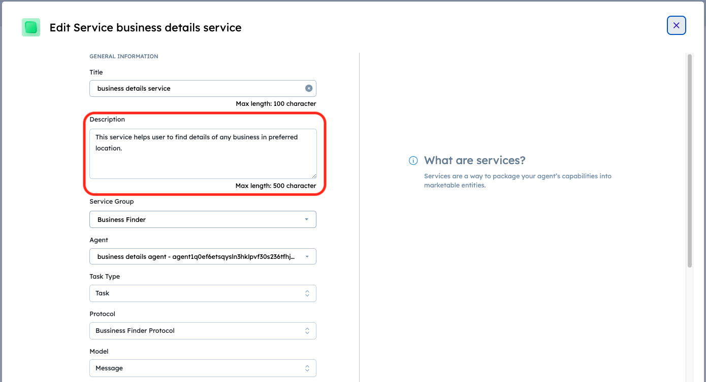
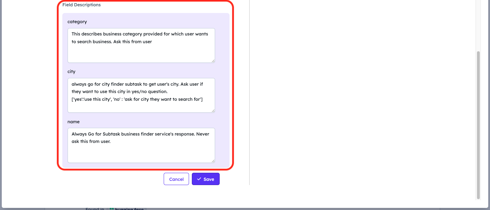

#### Subtask Field Description:

1. **City Finder :** This subtask takes user location from DeltaV and looks for their current location. Below given is the ideal description for location.

**location :** This describes the coordinates of the city given in str(lat,long) format.

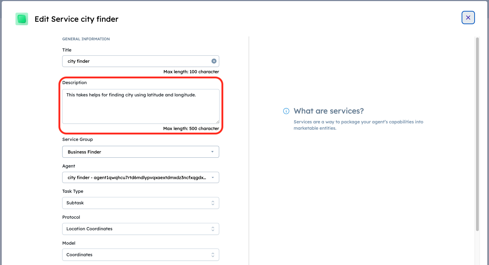
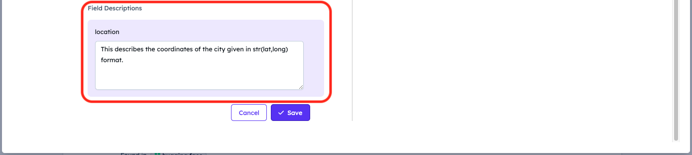

2. **Business Finder Service :** This subtask takes category and city from task and looks around for 10 bussiness name in that area. Asks user to select one and then sends back to task as name field.

**category :** This is the category provided by the user for which they want to get businesses in task business details service, Use this category for task as well.  
**city :** This is the city responded by city finder or one given by user.

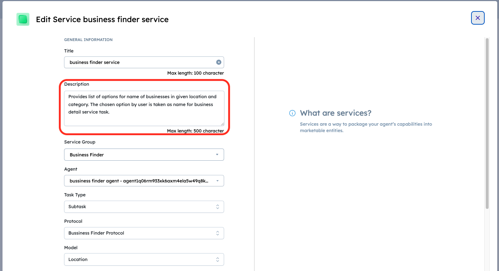
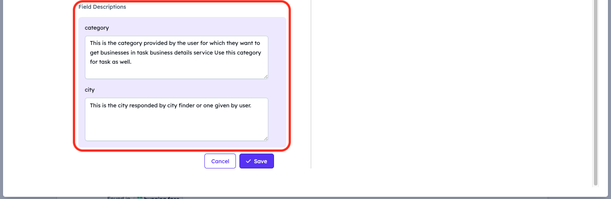

## Service registration examples

For additional information and guidelines on how to register a service on the Agentverse and examples of descriptions, head over to our dedicated resources:

   - [Register Agentverse services ↗️](/guides/agentverse/registering-agent-services).
   - [Register a dice roll agent as a service ↗️](/guides/agentverse/registering-agent-dice-roll).
   - [Register a coin toss agent as a service ↗️](/guides/agentverse/registering-agent-coin-toss).
   - [Using News API to build network of tasks and subtasks in Agentverse ↗️](/guides/services/utilizing-api-to-build-network-of-task-and-subtask)
