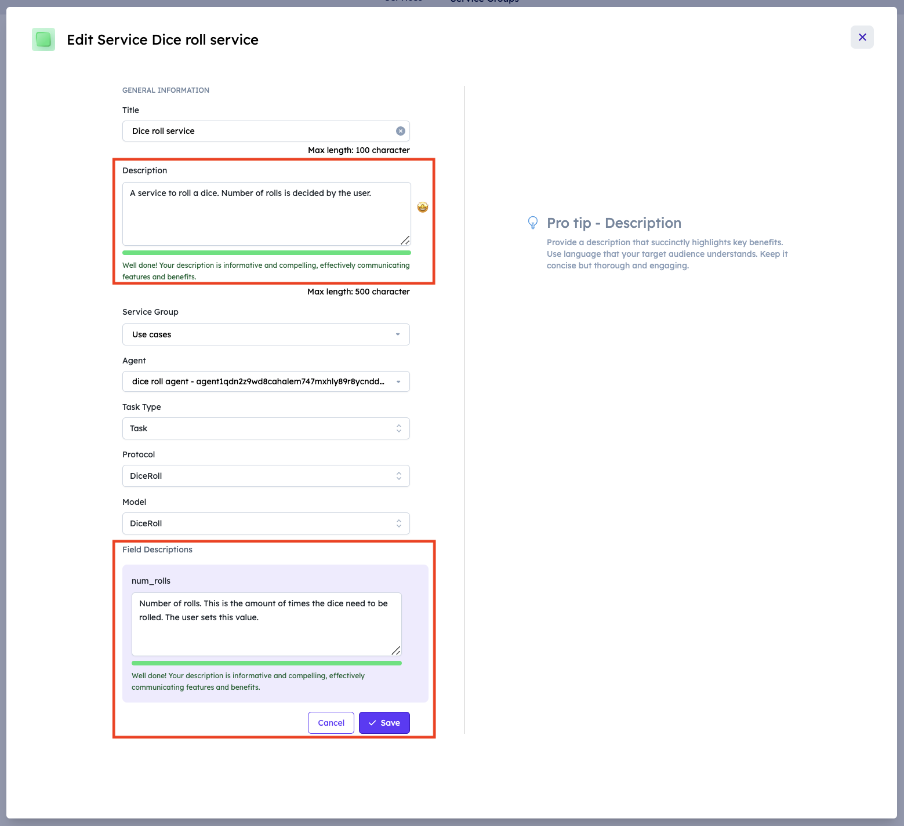

# The importance of a good field description

## The importance of describing your fields in a service

Whenever you are creating an agent service and you want to register it on the Agentverse to make it available on DeltaV, you are required to provide multiple information for the service in question. Among all information you need to provide, the **description** of your service is super important and thus it has to be detailed. Indeed, detailed descriptions would help users to understand the functionality of the service. This clarity ensures users can interact with the system effectively and know what to expect.

Also, the **field description** is very important and has to be detailed as much as possible. Field descriptions refer to the explanation provided for each field or parameter used taken into account within the service; it serves as a guide for users, developers, and AI Engine to understand the purpose, usage, and expected values of each field.

A well written field description enhances the AI Engine understanding of the type of Task or Subtask the service requires for execution. This would help in the accurate interpretation and execution of users' requests. For improved clarity, reinforcing key words with repetition alongside the descriptions is crucial. A clear and descriptive field description reduces ambiguity and prevent misunderstandings, both for users and the AI Engine. This clarity is crucial for smooth interactions and accurate delivery of the service.

For instance, consider the following service:

Providing a detailed field description is important to correctly execute the service.

 - two example of a task and subtask with highlighting difference of model descriptions

Field descriptions:

_news_ - This field describes the news which will be generated from the Generate News subtask. It should never be asked from the user directly and should always be provided by the respective subtasks. All news articles generated are presented as strings.

_news_type_ - This field represents the type of news selected by the user, such as categorical, regional, or keyword news. It should always be provided by the user and determines which subtask will be triggered for news generation.

## Service registration examples

For additional information and guidelines on how to register a service on the Agentverse and examples of descriptions, head over to our dedicated resources:

   - [Register Agentverse services ↗️](/guides/agentverse/registering-agent-services).
   - [Register a dice roll agent as a service ↗️](/guides/agentverse/registering-agent-dice-roll).
   - [Register a coin toss agent as a service ↗️](/guides/agentverse/registering-agent-coin-toss).
   - [Using News API to build network of tasks and subtasks in Agentverse ↗️](/guides/services/utilizing-api-to-build-network-of-task-and-subtask)

